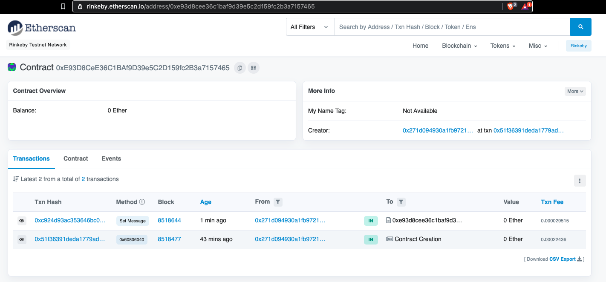

# Hello world contract
## Contract interaction using remix as UI
1. Get some ether from [Rinkeby faucet](https://faucet.rinkeby.io/)
1. Switch to Rinkeby network on metamask
1. Open [remix](http://remix.ethereum.org/) and copy solidity contract file
1. Configure “Injected Web3” environment
1. Set deployed contract address on “At address”
1. Hit the button setMessage and approve transaction gas
1. Check updated message using message button

### Resources
* Taken from [Stephen Grider](https://github.com/StephenGrider) course
